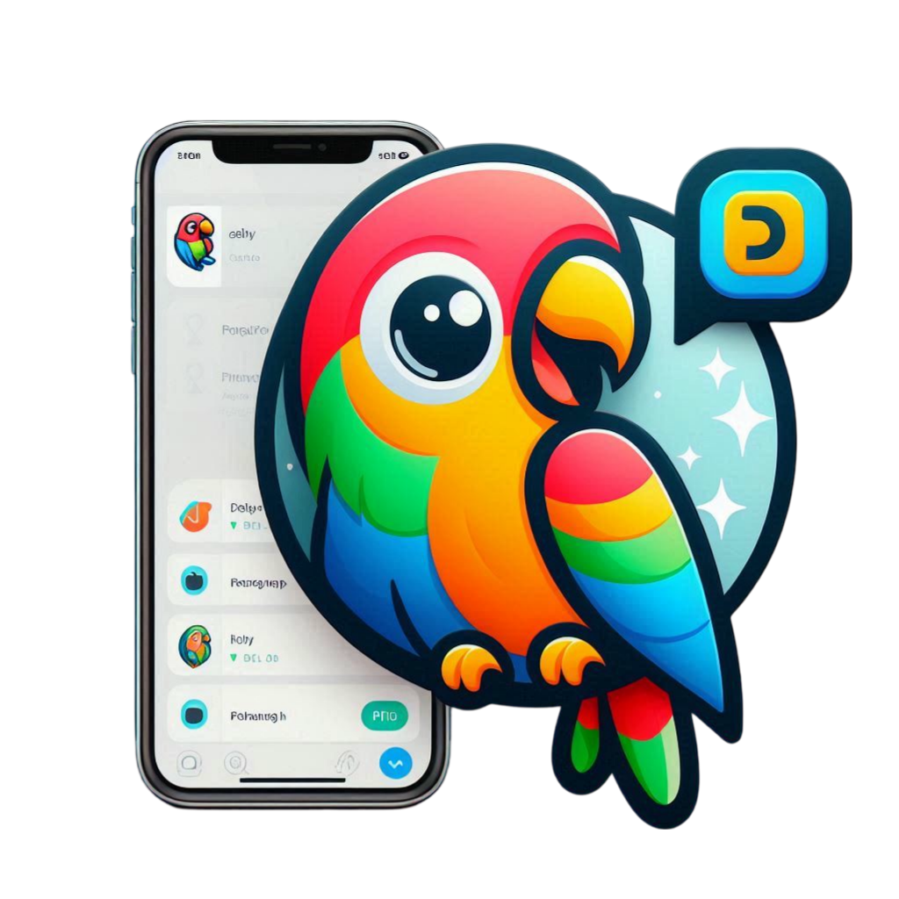

    

    

**ChatterBox**, una innovadora aplicación de mensajería diseñada para conectar a las personas mediante una comunicación fluida y en tiempo real. Con ChatterBox, puedes disfrutar de chats instantáneos, compartir multimedia y mantener conversaciones grupales, todo en una interfaz intuitiva y amigable.

<h1>
    Características Principales
</h1>

- **Mensajería Instantánea**: Envía y recibe mensajes en tiempo real con amigos y grupos.

- **Chats de Grupo**: Crea grupos para conversaciones entre múltiples usuarios.

- **Mensajes Multimedia**: Comparte fotos, videos, audios y GIFs de forma fácil y rápida.

- **Reacciones**: Responde a mensajes con emojis y reacciones personalizadas.

- **Notificaciones en Tiempo Real**: No te pierdas ningún mensaje importante gracias a las notificaciones instantáneas.

- **Status**: Comparte lo que estás haciendo o cómo te sientes con estados personalizados.

- **Modo Oscuro**: Mantén una apariencia más cómoda para los ojos en cualquier momento del día.

 
 

<h2>
    🌤️ Página provicional en onrender para probar:
     
     
    <a href="https://buzzly.onrender.com/" target="_blank">
        https://buzzly.onrender.com/ 🐝🐝🐝
    </a>
</h2>
